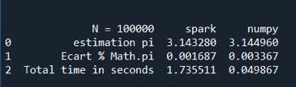
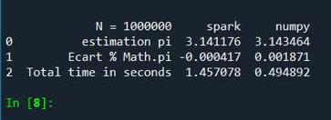

# ESTIMATION DE PI
-------------------------------------
## EXÉCUTION DU CODE
- open terminal
- pip install pyspark
- git clone https://github.com/Amadoutall/Big_data.git
- python src/script.py

-----------------------------------------
### Estimation de pi si n=100000

### Estimation de pi si n=1000000

Nous remarquons plus que n est grand plus que l'écart entre par rapport à Math.pi est petit.
